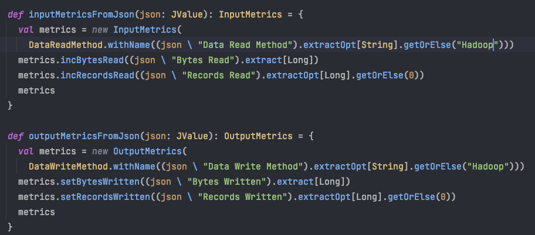

# Dr. Elephant

## 支持Spark2.x&3.x

## 

### 编译

从github clone一份最新的dr-elephant代码进行编译

```shell
git clone https://github.com/linkedin/dr-elephant.git
cd dr-elephant
```

编译必须依赖activator，下载activator包（[https://downloads.typesafe.com/typesafe-activator/1.3.12/typesafe-activator-1.3.12.zip](https://downloads.typesafe.com/typesafe-activator/1.3.12/typesafe-activator-1.3.12.zip)），并且设置环境变量

```shell
export ACTIVATOR_HOME=/path/to/unzipped/activator
export PATH=$ACTIVATOR_HOME/bin:$PATH
```

(可选择，但是推荐)编译新的dr-elephant页面，需要node环境

```shell
sudo yum install npm
sudo npm install -g bower
cd web; bower install; cd ..
```

开始编译，Dr-elephant是一个sbt项目，使用sbt编译。开始编译前指定hadoop和spark版本，只支持hadoop2.x和spark1.x，我们选择hadoop_version=2.7.3和spark_version=1.6.2（hadoop3.x和spark2.x和spark3.x不影响，问题后续解决）。

***compile.conf***

```
hadoop_version=2.7.3
spark_version=1.6.2
play_opts="-Dsbt.repository.config=app-conf/resolver.conf"
./compile.sh ./compile.conf
```

编译过程中发现几个问题：

- 编译发现很多包不存在，仓库链接已经过时。更改sbt仓库地址http://repo.typesafe.com/typesafe/releases为https://repo1.maven.org/maven2：

```
cat ~/.sbt/repositories

[repositories]
  local
  activator-launcher-local: file://${activator.local.repository-${activator.home-${user.home}/.activator}/repository}, [organization]/[module]/(scala_[scalaVersion]/)(sbt_[sbtVersion]/)[revision]/[type]s/[artifact](-[classifier]).[ext]
  activator-local: file://${activator.local.repository-/Users/xiongzhigang/work/wanmei/share/activator-dist-1.3.12/repository}, [organization]/[module]/(scala_[scalaVersion]/)(sbt_[sbtVersion]/)[revision]/[type]s/[artifact](-[classifier]).[ext]
  maven-central
  typesafe-releases: https://repo1.maven.org/maven2
  typesafe-ivy-releasez: http://repo.typesafe.com/typesafe/ivy-releases, [organization]/[module]/(scala_[scalaVersion]/)(sbt_[sbtVersion]/)[revision]/[type]s/[artifact](-[classifier]).[ext]
```

- 编译快结束后发现测试用例过不了，修改compile.sh，注释掉408行

```
# play_command $OPTS clean compile test $extra_commands
```

编译成功后在dist目录生成dr-elephant-2.1.7.zip

### 部署

#### 部署Dr-elephant

需要环境jdk1.8，Hadoop，Spark，mysql。提前建好mysql库drelephant，修改app-conf/elephant.conf:

```
# Play application server port
http_port=8080

# Database configuration
db_url=xxx:3306
db_name=xxx
db_user=xxx
db_password="xxx"
```

设置jdk，Hadoop，Spark相关的环境变量，修改bin/start.sh

```shell
# HADOOP & SPARK
export HADOOP_HOME=/opt/cloudera/parcels/CDH/lib/hadoop
export HADOOP_CONF_DIR=/etc/hadoop/conf
export SPARK_HOME=/opt/cloudera/parcels/CDH/lib/spark
export SPARK_CONF_DIR=/etc/spark/conf

export JAVA_HOME="$project_root/../jdk1.8.0_191"
export JAVA_LIB_PATH=$JAVA_HOME/lib

# 兼容HADOOP3X
# Get hadoop version by executing 'hadoop version' and parse the result
HADOOP_VERSION=$(hadoop version | awk '{if (NR == 1) {print $2;}}')
if [[ $HADOOP_VERSION == 1* ]];
then
  echo "This is hadoop1.x grid. Switch to hadoop2 if you want to use Dr. Elephant"
elif [[ $HADOOP_VERSION == 2* || $HADOOP_VERSION == 3* ]];
then
  JAVA_LIB_PATH=$HADOOP_HOME"/lib/native"
  echo "This is hadoop${HADOOP_VERSION} grid. Adding Java library to path: "$JAVA_LIB_PATH
else
  echo "error: Hadoop isn't properly set on this machine. Could you verify cmd 'hadoop version'? "
  exit 1
fi
```

启动Dr-elephant

```shell
sh bin/start.sh
```

发现guava版本冲突，lib/com.google.guava.guava-18.0.jar替换为lib/guava-28.1-jre.jar问题解决。

配置各任务拉取信息类，修改app-conf/FetcherConf.xml

```xml
<fetchers>
   <fetcher>
    <applicationtype>mapreduce</applicationtype>
    <classname>com.linkedin.drelephant.mapreduce.fetchers.MapReduceFSFetcherHadoop2</classname>
    <params>
      <sampling_enabled>false</sampling_enabled>
      <history_log_size_limit_in_mb>500</history_log_size_limit_in_mb>
      <history_server_time_zone>UTC</history_server_time_zone>
    </params>
  </fetcher>

  <fetcher>
    <applicationtype>spark</applicationtype>
    <classname>com.linkedin.drelephant.spark.fetchers.SparkFetcher</classname>
    <params>
      <use_rest_for_eventlogs>true</use_rest_for_eventlogs>
      <should_process_logs_locally>true</should_process_logs_locally>
    </params>
  </fetcher>
</fetchers>
```

设置处理队列大小和拉取历史任务的时间，修改GeneralConf.xml：

```xml
 <!--
  Initial window in MS to indicate how much older apps to fetch from RM.
  -->
  <property>
    <name>drelephant.analysis.fetch.initial.windowMillis</name>
    <value>3600000</value>
  </property>

 <property>
    <name>drelephant.analysis.thread.count</name>
    <value>30</value>
    <description>Number of threads to analyze the completed jobs</description>
  </property>
```

#### MapReduce任务采集

MapReduce任务信息拉取是通过com.linkedin.drelephant.mapreduce.fetchers.MapReduceFSFetcherHadoop2这个类实现的，发现此类是通过拉取/user/history/done（mapreduce.jobhistory.done-dir）和/user/history/done_intermediate（mapreduce.jobhistory.intermediate-done-dir）目录获取的任务信息。因此Dr-elephant启动用户必须能够访问这2个目录。

另发现mapreduce任务类型无法识别：


修改app-conf/JobTypeConf.xml，增加jobType问题解决。

```xml
<jobType>
    <name>MapReduce</name>
    <applicationtype>mapreduce</applicationtype>
    <conf>mapreduce.map.java.opts</conf>
  </jobType>
```

#### TEZ任务采集

tez任务信息是从timelineserver获取的，因此需要启动timelineserver。

修改yarn-site.xml：

```xml
<property>
    <name>yarn.timeline-service.enabled</name>
    <value>true</value>
</property>
<property>
    <name>yarn.timeline-service.hostname</name>
    <value>cvm-remain-cdp-test03</value>
</property>
<property>
    <name>yarn.timeline-service.http-cross-origin.enabled</name>
    <value>true</value>
</property>
<property>
    <name>yarn.resourcemanager.system-metrics-publisher.enabled</name>
    <value>true</value>
</property>
<property>
    <name>yarn.timeline-service.generic-application-history.enabled</name>
    <value>true</value>
</property>
<property>
    <name>yarn.timeline-service.addres</name>
    <value>${yarn.timeline-service.hostname}:10200</value>
</property>
<property>
    <name>yarn.timeline-service.webapp.address</name>
    <value>${yarn.timeline-service.hostname}:8188</value>
</property>
<property>
    <name>mapreduce.job.emit-timeline-data</name>
    <value>true</value>
</property>
```

启动timelineserver

```shell
sudo -u mapred yarn --daemon  start timelineserver
```

修改tez-site.xml

```xml
<property>
    <name>tez.history.logging.service.class</name>
    <value>org.apache.tez.dag.history.logging.ats.ATSHistoryLoggingService</value>
</property>
<property>
    <name>tez.yarn.ats.enabled</name>
    <value>true</value>
</property>
<property>
    <name>tez.allow.disabled.timeline-domains</name>
    <value>true</value>
</property>
<property>
    <name>tez.tez-ui.history-url.base</name>
    <value>http://cvm-remain-cdp-test03.data:9999/tez-ui/</value>
</property>
```

新增tez任务采集，修改app-conf/FetcherConf.xml

```xml
   <!--
     REST based fetcher for Tez jobs which pulls job metrics and data from Timeline Server API
   -->
  <fetcher>
    <applicationtype>tez</applicationtype>
    <classname>com.linkedin.drelephant.tez.fetchers.TezFetcher</classname>
  </fetcher>
```

重启Dr-elephant

补充：

- TEZ-UI中的Hive Queries为空，在hive-site.xml中加下面配置，问题解决。

```xml
<property>
    <name>hive.exec.failure.hooks</name>
    <value>org.apache.hadoop.hive.ql.hooks.ATSHook</value>
</property>
<property>
    <name>hive.exec.post.hooks</name>
    <value>org.apache.hadoop.hive.ql.hooks.ATSHook</value>
</property>
<property>
    <name>hive.exec.pre.hooks</name>
    <value>org.apache.hadoop.hive.ql.hooks.ATSHook</value>
</property>
```

- 从history server 跳转到TEZ UI任务详细页需要tez.am.tez-ui.history-url.template参数配置正确，例如：__HISTORY_URL_BASE__?viewPath=/#/tez-app/__APPLICATION_ID__

#### Spark2任务采集

确保以下2点就可以

- start.sh中的Spark配置环境变量：export SPARK_CONF_DIR=/etc/spark/conf
- app-conf/FetcherConf.xml中配置了信息拉取类：com.linkedin.drelephant.spark.fetchers.SparkFetcher

#### Spark3任务采集

把Spark配置环境变量设置为：export SPARK_CONF_DIR=/etc/spark3/conf

重启Dr-elephant，发现任务收集失败，查看dr.log，发现报错：


经查询SparkListenerResourceProfileAdded事件是在spark3.1x才有的，在spark-1.6.2中的ReplayListenerBus类遇到不识别的事件直接全部抛出异常，因此修改下面代码：


重新打包，替换掉Dr-elephant lib下的spark-core包：

```shell
cp spark-core_2.10-1.6.2.jar lib/org.apache.spark.spark-core_2.10-1.6.2.jar
```

重启Dr-elephant问题解决。

#### 如何同时收集spark2和spark3的任务信息呢？

可以使用com.linkedin.drelephant.spark.fetchers.FSFetcher类来收集，修改app-conf/FetcherConf.xml

```xml
<fetcher>
    <applicationtype>spark</applicationtype>
    <classname>com.linkedin.drelephant.spark.fetchers.FSFetcher</classname>
    <params>
      <event_log_location_uri>/user/spark/applicationHistory</event_log_location_uri>
    </params>
  </fetcher>
```

修改spark3的配置spark.eventLog.dir=/user/spark/applicationHistory

重启Dr-elephant，发现com.linkedin.drelephant.spark.fetchers.FSFetcher解析eventLog文件路径错误，导致无法收集，因此修改Dr-elephant的SparkUtils.scala：


重新打包问题解决。

#### spark2.x/3.x信息收集不全问题

- Job和Stage信息不全。由于从 Spark 2.0 开始，在管理堆外的存储内存时不再基于 Tachyon，而是与堆外的执行内存一样，基于 JDK Unsafe API 实现，所以得修改Tachyon相关指标提取代码。修改Spark-core.1.6.2的JsonProtocol.scala：


- Executor Metrics信息缺失。spark2/3的Task Metrics中没有Host Name、Data Read Method、Data Write Method字段，Input Metrics中没有导致异常。




最终打好的[spark-core_2.10-1.6.2.jar](./spark-core_2.10-1.6.2.jar)

#### 添加yarn任务ttl功能

由于线上yarn任务数量多，而Dr-elephant本身并没有滚动删除任务记录的功能，因此自己着手开发，在app-conf/GeneralConf.xml新增一个配置项：

```xml
<property>
    <name>drelephant.analysis.history.ttl</name>
    <value>604800000</value>
    <description>Yarn app result history live of time, in milliseconds.
    The value must be greater than "drelephant.analysis.fetch.initial.windowMillis".
    </description>
  </property>
```

在ElephantRunner.java run方法中添加如下代码：

```java
// Scrolling delete history yarn result，_historyTtlThread读取配置"drelephant.analysis.history.ttl"
if (_historyTtl > 0) {
  _historyTtlThread = new Thread(new HistoryTtlThread(), "HistoryTtl Thread");
  _historyTtlThread.start();
}
```

HistoryTtlThread：

```java
private class HistoryTtlThread implements Runnable {
        @Override
        public void run() {
            List<AppResult> results = new ArrayList<>();
            int failCount = 0;
            int ttlJobs = 0;

            long beginTime = Time.monotonicNow();
            long finishTime = System.currentTimeMillis() - Math.max(_historyTtl, _initialFetchWindow);
            do {
                try {
                    results = AppResult.find.select(AppResult.TABLE.ID)
                            .where()
                            .lt(AppResult.TABLE.FINISH_TIME, finishTime)
                            .order()
                            .desc(AppResult.TABLE.FINISH_TIME)
                            .setMaxRows(1000)
                            .findList();

                    if (results != null && !results.isEmpty()) {
                        ttlJobs += results.size();
                        List<AppResult> finalResults = results;
                        Ebean.execute(new TxRunnable() {
                            public void run() {
                                for (AppResult result : finalResults) {
                                    result.delete();
                                }
                            }
                        });
                    }
                } catch (Exception e) {
                    failCount++;
                    logger.error("Failed historyTtl jobs for analysis... ", e);
                }

            } while (results != null && !results.isEmpty() && failCount < 3);

            long endTime = Time.monotonicNow();
            logger.info("Finished historyTtl jobs for analysis... " + ttlJobs + " jobs deleted. "+ failCount + " times error. Took " +
                    (endTime - beginTime) + " ms.");
        }
    }
```

上面代码通过ebean的orm框架可以实现级连删除，但是由于yarn_app_heuristic_result_details表结构并没有单个的自增主键id，导致级连删除失败，因此做如下改动：

AppHeuristicResultDetails新增id字段，并把id字段设为主键：

```java
@Entity
@Table(name = "yarn_app_heuristic_result_details")
public class AppHeuristicResultDetails extends Model {

    private static final long serialVersionUID = 3L;

    public static final int NAME_LIMIT = 128;
    public static final int VALUE_LIMIT = 255;
    public static final int DETAILS_LIMIT = 65535;

    public static class TABLE {
        public static final String TABLE_NAME = "yarn_app_heuristic_result_details";
        public static final String ID = "id";
        public static final String APP_HEURISTIC_RESULT_ID = "yarnAppHeuristicResult";
        public static final String NAME = "name";
        public static final String VALUE = "value";
        public static final String DETAILS = "details";
    }

    @JsonBackReference
    @ManyToOne(cascade = CascadeType.ALL)
    public AppHeuristicResult yarnAppHeuristicResult;

    @JsonIgnore
    @Id
    public int id;

    @Column(length = NAME_LIMIT, nullable = false)
    public String name;

    @Column(length = VALUE_LIMIT, nullable = false)
    public String value;

    @Column(nullable = true)
    public String details;
}
```

新增一个修改yarn_app_heuristic_result_details表结构的sql文件conf/evolutions/default/7.sql：

```sql
# --- !Ups

ALTER TABLE yarn_app_heuristic_result_details
    DROP PRIMARY KEY,
    DROP FOREIGN KEY yarn_app_heuristic_result_details_f1;

ALTER TABLE yarn_app_heuristic_result_details
    ADD id INT AUTO_INCREMENT COMMENT 'The application heuristic result details id' FIRST,
    ADD PRIMARY KEY (id),
    ADD CONSTRAINT yarn_app_heuristic_result_details_f1 FOREIGN KEY (yarn_app_heuristic_result_id) REFERENCES yarn_app_heuristic_result (id);

# --- !Downs
```
#### 添加收集tez sql功能
新增一个Heuristic：TezHiveQueryHeuristic
```java
/**
 * Analyzes hive query info
 */
public class TezHiveQueryHeuristic implements Heuristic<TezApplicationData> {

    /**
     * hive conf
     */
    private static final String HIVE_QUERY_ID_CONF = "hive.query.id";
    private static final String HIVE_QUERY_STRING = "hive.query.string";

    private HeuristicConfigurationData _heuristicConfData;

    public TezHiveQueryHeuristic(HeuristicConfigurationData heuristicConfData) {
        this._heuristicConfData = heuristicConfData;
    }

    public HeuristicConfigurationData getHeuristicConfData() {
        return _heuristicConfData;
    }

    public HeuristicResult apply(TezApplicationData data) {
        if (!data.getSucceeded()) {
            return null;
        }

        String queryId = data.getConf().getProperty(HIVE_QUERY_ID_CONF);
        if (queryId == null) {
            return null;
        }

        String queryString = data.getConf().getProperty(HIVE_QUERY_STRING);

        if (queryString == null) {
            return null;
        }

        queryString = decodeQueryString(queryString);
        Severity severity = Severity.NONE;
        HeuristicResult result = new HeuristicResult(_heuristicConfData.getClassName(),
                _heuristicConfData.getHeuristicName(), severity, 0);

        result.addResultDetail("Hive Query String", queryId, queryString);

        return result;

    }

    private String decodeQueryString(String queryString) {
        try {
            return URLDecoder.decode(queryString, StandardCharsets.UTF_8.toString());
        } catch (UnsupportedEncodingException e) {
            return queryString;
        }
    }
}
```
修改HeuristicConf.xml，添加hive query指标
```xml
<heuristic>
    <applicationtype>tez</applicationtype>
    <heuristicname>Hive Query</heuristicname>
    <classname>com.linkedin.drelephant.tez.heuristics.TezHiveQueryHeuristic</classname>
    <viewname>views.html.help.tez.helpMapperDataSkew</viewname>
</heuristic>
```
